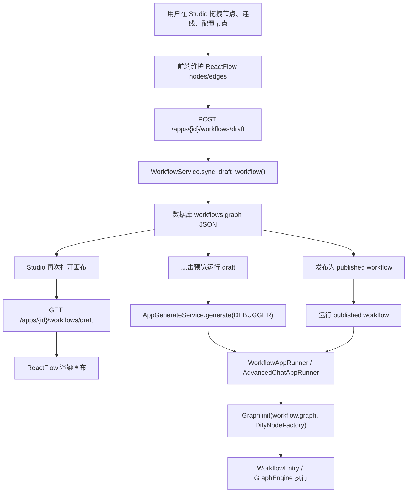
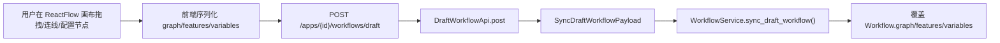
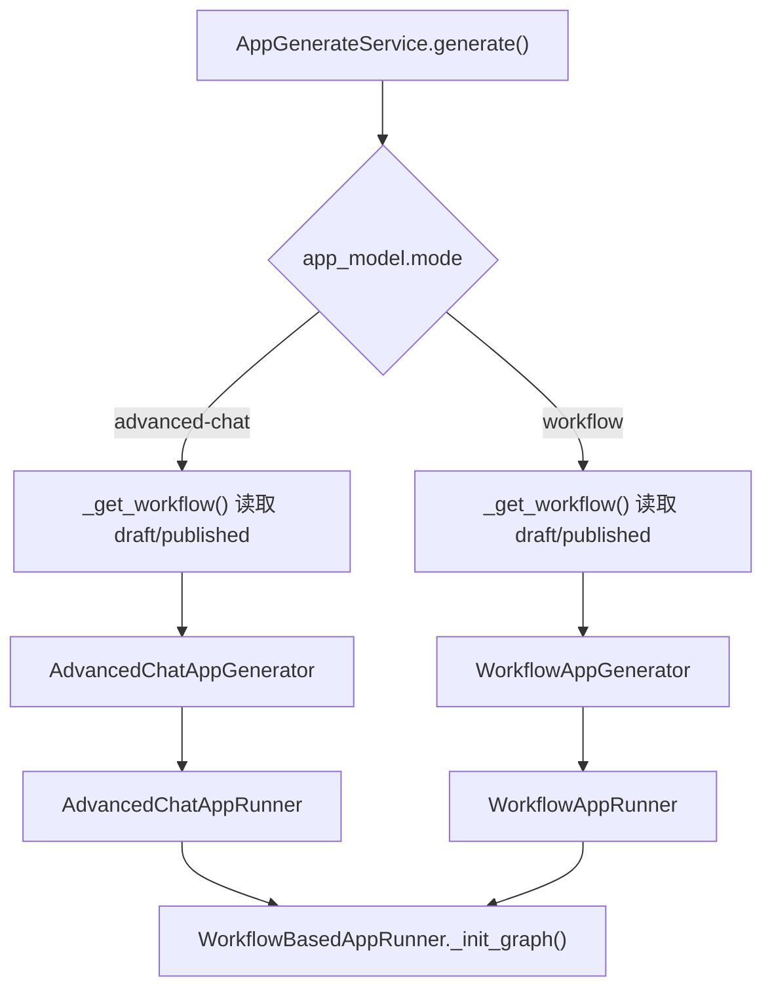
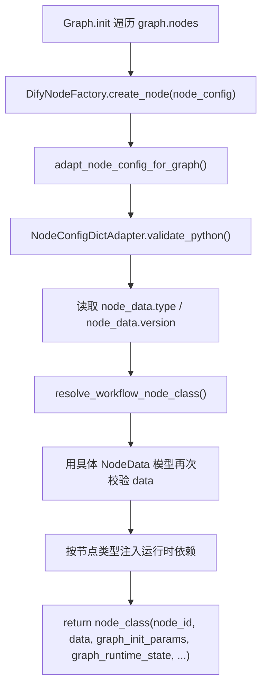
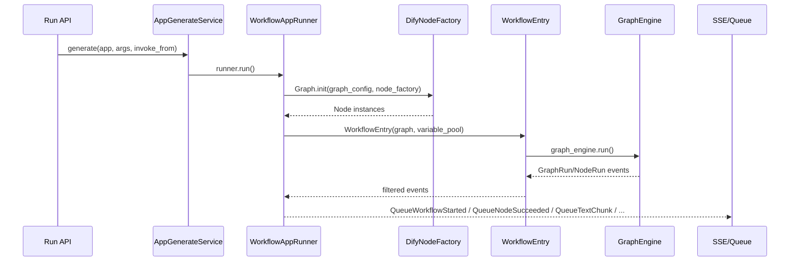
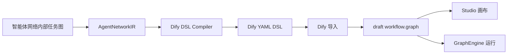
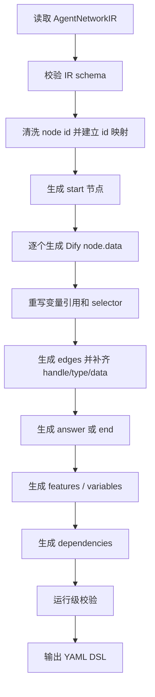

# Dify DSL、画布与工作流运行对接说明

本文面向没有 Dify 代码基础、但需要把自研智能体网络接入 Dify Studio 画布并由 Dify 运行的工程团队。本文只讨论 Dify 原生实现逻辑和对接方案，不讨论当前仓库里的具体改动实现。

## 1. 一句话结论

Dify Studio 的画布、DSL 导入导出、预览运行、发布运行，核心都围绕同一个数据结构：`workflow.graph`。

```text
YAML DSL 是导入/导出的文件外壳
workflow.graph 是数据库里保存的画布与运行图
GraphEngine 是运行时执行 workflow.graph 的引擎
```

因此，如果我们的目标是不仅可视化，而且要让 Dify 直接运行，自研智能体网络需要生成的不只是“看起来像画布”的 YAML，而是一个运行时合法的 Dify `workflow.graph`。DSL 只是把这个 `workflow.graph` 包装成可导入文件。

推荐总路径：

```text
自研智能体网络编排结果
  -> 结构化中间格式 AgentNetworkIR
  -> 编译成 Dify 原生 YAML DSL
  -> Dify 导入 DSL
  -> 写入 draft workflow.graph
  -> Dify Studio 画布展示
  -> Dify 预览/发布时用 GraphEngine 执行同一份 workflow.graph
```

核心边界：

- 只想展示：`nodes/edges` 和基础 `data.type/title` 对齐即可。
- 想让 Dify 运行：每个节点的 `data` 必须满足对应 Dify 节点运行 schema，模型、工具、知识库、变量引用、输出声明、依赖和凭据都必须真实可用。

## 2. Dify 原生用户逻辑总览

Dify 原始使用方式不是“拖拽画布后生成一份 Python/JS 代码再运行”。它的真实逻辑更接近声明式 workflow：



也就是说，Dify 的“画布结构”和“运行结构”不是两份独立结构。`workflow.graph` 同时承担：

- 画布渲染：前端 ReactFlow 读取 `nodes/edges/viewport`。
- 运行拓扑：后端 GraphEngine 读取 `nodes/edges`。
- 节点配置：后端节点工厂读取每个节点的 `data`。
- 变量依赖：节点通过 `{{#node_id.var#}}` 或 selector 引用上游输出。

## 3. DSL 导入到画布展示链路

```mermaid
flowchart LR
  A["用户上传或粘贴 YAML DSL"] --> B["POST /apps/imports"]
  B --> C["AppImportApi"]
  C --> D["AppDslService.import_app()"]
  D --> E["yaml.safe_load 解析 YAML"]
  E --> F["版本兼容与 dependencies 检查"]
  F --> G["_create_or_update_app() 创建或更新 App"]
  G --> H["WorkflowService.sync_draft_workflow()"]
  H --> I["Workflow 表写入 draft graph/features/variables"]
  I --> J["GET /apps/{id}/workflows/draft"]
  J --> K["useWorkflowInit() 获取 draft"]
  K --> L["initialNodes()/initialEdges() 补前端画布字段"]
  L --> M["ReactFlow 渲染 Studio 画布"]
```



关键代码入口：

| 层级 | 代码位置 | 职责 |
| --- | --- | --- |
| DSL 导入控制器 | `api/controllers/console/app/app_import.py` | 接收 `/apps/imports`，鉴权后委托导入服务 |
| DSL 导入服务 | `api/services/app_dsl_service.py` | 解析 YAML、检查版本、处理依赖、创建/更新 App |
| draft 写入 | `api/services/workflow_service.py` | `sync_draft_workflow()` 写入 draft workflow |
| Workflow 模型 | `api/models/workflow.py` | `Workflow.graph` 存 JSON 字符串，`graph_dict` 转为 Python dict |
| 画布加载 | `web/app/components/workflow-app/hooks/use-workflow-init.ts` | 前端获取 draft workflow |
| 画布初始化 | `web/app/components/workflow/utils/workflow-init.ts` | 补齐 ReactFlow 节点/边渲染字段 |

导入 DSL 后，Dify 并不会再“反编译”出另一套结构。DSL 中的 `workflow.graph` 会被原样作为 draft workflow 的 graph 主体写入数据库。前端打开画布时读取的也是这份 graph。

## 4. 拖拽画布后的保存链路



这条链路和 DSL 导入最终汇合到同一个服务：`WorkflowService.sync_draft_workflow()`。

因此三种来源最终维护的是同一种数据契约：

- 用户拖拽画布保存。
- YAML DSL 导入。
- Dify 自身 workflow generator 生成 graph。

它们的共同出口都是 `workflow.graph`。

## 5. `workflow.graph` 在 Python 代码中长什么样

数据库字段：

- `Workflow.graph`：`LongText`，保存 JSON 字符串。
- `Workflow.graph_dict`：`json.loads(self.graph)` 后得到的 `Mapping[str, Any]`。
- `Workflow.to_dict()`：导出 DSL 时把 `graph/features/environment_variables/conversation_variables` 包回 YAML。

代码位置：

- `api/models/workflow.py:168`：`Workflow` 模型。
- `api/models/workflow.py:296`：`graph_dict`。
- `api/models/workflow.py:662`：`to_dict()`。

运行时拿到的是普通 Python dict，形态如下：

```python
workflow.graph_dict == {
    "nodes": [
        {
            "id": "start",
            "type": "custom",
            "position": {"x": 80, "y": 120},
            "positionAbsolute": {"x": 80, "y": 120},
            "width": 244,
            "height": 90,
            "sourcePosition": "right",
            "targetPosition": "left",
            "data": {
                "type": "start",
                "title": "Start",
                "desc": "",
                "selected": False,
                "variables": [
                    {
                        "variable": "query",
                        "label": "用户问题",
                        "type": "paragraph",
                        "required": True,
                        "max_length": 4096,
                        "options": [],
                    }
                ],
            },
        },
        {
            "id": "llm_1",
            "type": "custom",
            "position": {"x": 420, "y": 120},
            "positionAbsolute": {"x": 420, "y": 120},
            "width": 244,
            "height": 90,
            "sourcePosition": "right",
            "targetPosition": "left",
            "data": {
                "type": "llm",
                "title": "生成回答",
                "desc": "",
                "selected": False,
                "model": {
                    "provider": "langgenius/openai/openai",
                    "name": "gpt-4o-mini",
                    "mode": "chat",
                    "completion_params": {"temperature": 0.7},
                },
                "prompt_template": [
                    {"role": "system", "text": "你是一个助手。"},
                    {"role": "user", "text": "{{#start.query#}}"},
                ],
                "context": {"enabled": False, "variable_selector": []},
                "memory": {
                    "window": {"enabled": False, "size": 10},
                    "role_prefix": {"user": "", "assistant": ""},
                    "query_prompt_template": "",
                },
                "vision": {"enabled": False},
                "variables": [],
            },
        },
        {
            "id": "answer",
            "type": "custom",
            "position": {"x": 760, "y": 120},
            "positionAbsolute": {"x": 760, "y": 120},
            "data": {
                "type": "answer",
                "title": "直接回复",
                "answer": "{{#llm_1.text#}}",
                "variables": [],
            },
        },
    ],
    "edges": [
        {
            "id": "start-source-llm_1-target",
            "type": "custom",
            "source": "start",
            "sourceHandle": "source",
            "target": "llm_1",
            "targetHandle": "target",
            "data": {
                "sourceType": "start",
                "targetType": "llm",
                "isInIteration": False,
                "isInLoop": False,
            },
            "zIndex": 0,
        },
        {
            "id": "llm_1-source-answer-target",
            "type": "custom",
            "source": "llm_1",
            "sourceHandle": "source",
            "target": "answer",
            "targetHandle": "target",
            "data": {
                "sourceType": "llm",
                "targetType": "answer",
                "isInIteration": False,
                "isInLoop": False,
            },
            "zIndex": 0,
        },
    ],
    "viewport": {"x": 0, "y": 0, "zoom": 0.7},
}
```

需要区分两层字段：

| 字段 | 面向谁 | 含义 |
| --- | --- | --- |
| 节点顶层 `type: custom` | 前端 ReactFlow | 用哪个画布组件渲染 |
| 节点 `data.type` | Dify 运行时 | 真实业务节点类型，例如 `start`、`llm`、`if-else` |
| 节点 `data.version` | Dify 节点工厂 | 选择哪个版本的节点实现；缺省时依赖节点数据模型默认值，不建议手写时省略 |
| 节点 `data.title/desc` | 前端和运行日志 | 展示名称和描述 |
| 节点 `data.model/tool/code/...` | Dify 节点实现 | 节点运行所需配置 |
| 边 `source/target` | Graph 拓扑 | 上游和下游节点 id |
| 边 `sourceHandle/targetHandle` | Graph 拓扑和分支 | 普通节点通常是 `source/target`，分支节点必须是 case/class id |
| 边 `data.sourceType/targetType` | 前端和辅助逻辑 | 画布渲染、补全、调试使用 |

运行时真正创建节点时，`DifyNodeFactory.create_node()` 会读取节点 `data`，经 `NodeConfigDictAdapter.validate_python()` 转成节点数据模型，再根据 `data.type` 和 `data.version` 找到对应 Node 类。

## 6. Dify 如何执行 `workflow.graph`

### 6.1 draft 预览运行入口

高级对话应用：

- 入口：`POST /apps/<uuid:app_id>/advanced-chat/workflows/draft/run`
- 控制器：`AdvancedChatDraftWorkflowRunApi`
- 代码位置：`api/controllers/console/app/workflow.py:546`

工作流应用：

- 入口：`POST /apps/<uuid:app_id>/workflows/draft/run`
- 控制器：`DraftWorkflowRunApi`
- 代码位置：`api/controllers/console/app/workflow.py:957`

两个入口都会调用：

```python
AppGenerateService.generate(
    app_model=app_model,
    user=current_user,
    args=args,
    invoke_from=InvokeFrom.DEBUGGER,
    streaming=True,
)
```

`InvokeFrom.DEBUGGER` 是关键：它告诉 `AppGenerateService._get_workflow()` 读取 draft workflow，而不是 published workflow。

### 6.2 published 运行入口

发布后运行时，Dify 不再读取 draft，而是读取 App 当前绑定的 published workflow。

核心逻辑在 `AppGenerateService._get_workflow()`：

```text
if workflow_id 指定:
  读取指定 published workflow
elif invoke_from == DEBUGGER:
  读取 draft workflow
else:
  读取 app_model.workflow_id 指向的 published workflow
```

因此：

- Studio 预览运行：执行 draft graph。
- 发布后 WebApp / Service API 运行：执行 published graph。
- 发布动作本质上是把 draft workflow 复制成一个带版本号的 published workflow。

发布代码位置：

- `api/services/workflow_service.py:454`：`publish_workflow()`。
- 发布时会校验 graph 结构、模型/工具凭据、Agent 绑定，并复制 graph、features、变量配置。

### 6.3 AppGenerateService 如何选择 Runner

代码位置：`api/services/app_generate_service.py`。

执行分流逻辑：



关键代码：

- `api/services/app_generate_service.py`：`generate()` 根据 `AppMode` 选择 generator。
- `api/core/app/apps/advanced_chat/app_generator.py:651`：实例化 `AdvancedChatAppRunner`。
- `api/core/app/apps/workflow/app_generator.py:630`：实例化 `WorkflowAppRunner`。
- `api/core/app/apps/advanced_chat/app_runner.py:55`：高级对话 runner。
- `api/core/app/apps/workflow/app_runner.py:31`：工作流 runner。

### 6.4 Runner 做了什么

`AdvancedChatAppRunner` 和 `WorkflowAppRunner` 都继承同一个基类：`WorkflowBasedAppRunner`。

它们的差异主要是输入和会话语义：

| Runner | 应用模式 | 输入语义 | 终止节点 |
| --- | --- | --- | --- |
| `AdvancedChatAppRunner` | `advanced-chat` | query、files、conversation、message、conversation variables | `answer` |
| `WorkflowAppRunner` | `workflow` | inputs、files、system variables | `end` |

共同动作：

1. 构建系统变量，例如用户、文件、app id、workflow id、执行 id。
2. 读取 `workflow.environment_variables` 和会话变量。
3. 创建 `VariablePool`。
4. 找到根节点：`get_default_root_node_id(workflow.graph_dict)`。
5. 把用户输入写入根节点对应变量。
6. 调用 `_init_graph()` 把 `workflow.graph_dict` 初始化为可执行 Graph。
7. 创建 `WorkflowEntry`。
8. 给 GraphEngine 挂载持久化、限额、观测、Agent session cleanup 等 layer。
9. 调用 `workflow_entry.run()`，把 GraphEngine 事件转成 Dify 队列事件或 SSE。

### 6.5 `_init_graph()` 如何把 dict 变成 Graph

代码位置：`api/core/app/apps/workflow_app_runner.py:113`。

关键逻辑：

```python
def _init_graph(...):
    if "nodes" not in graph_config or "edges" not in graph_config:
        raise ValueError("nodes or edges not found in workflow graph")

    if not isinstance(graph_config.get("nodes"), list):
        raise ValueError("nodes in workflow graph must be a list")

    if not isinstance(graph_config.get("edges"), list):
        raise ValueError("edges in workflow graph must be a list")

    run_context = build_dify_run_context(...)

    graph_init_context = DifyGraphInitContext(
        workflow_id=workflow_id,
        graph_config=graph_config,
        run_context=run_context,
        call_depth=0,
    )

    node_factory = DifyNodeFactory.from_graph_init_context(
        graph_init_context=graph_init_context,
        graph_runtime_state=graph_runtime_state,
    )

    if root_node_id is None:
        root_node_id = get_default_root_node_id(graph_config)

    graph = Graph.init(
        graph_config=graph_config,
        node_factory=node_factory,
        root_node_id=root_node_id,
    )

    return graph
```

注意：`Graph.init` 和 `GraphEngine` 来自 `graphon` 包。本仓库中的 Dify 代码负责：

- 提供 graph_config。
- 找 root node。
- 构建 `DifyGraphInitContext`。
- 构建 `DifyNodeFactory`。
- 给节点注入 Dify 自己的运行时依赖。
- 把 GraphEngine 事件转成 Dify API/SSE/日志/持久化语义。

### 6.6 DifyNodeFactory 如何实例化节点

代码位置：

- `api/core/workflow/node_factory.py:277`：`DifyNodeFactory`。
- `api/core/workflow/node_factory.py:375`：`create_node()`。

核心流程：



不同节点会被注入不同依赖：

| 节点类型 | 运行时依赖示例 |
| --- | --- |
| `llm` | 模型凭据、模型工厂、memory、prompt serializer、文件保存器、Jinja renderer |
| `code` | Dify code executor、代码执行限制 |
| `template-transform` | Jinja2 template renderer |
| `http-request` | SSRF proxy HTTP client、超时/大小限制、文件管理 |
| `tool` | Tool runtime、工具文件管理 |
| `knowledge-retrieval` | 检索运行时、模型/检索资源依赖 |
| `agent` | Agent strategy resolver 或 Agent v2 backend/binding/runtime request builder |
| `human-input` | Human input runtime、form repository |

这说明一个重要事实：如果你们生成的节点只是有 `data.type: llm`，但缺少真实 `model` 配置，节点可能能显示，但运行时会在 `DifyNodeFactory` 或具体 NodeData 校验/执行阶段失败。

### 6.7 WorkflowEntry 和 GraphEngine 如何执行

代码位置：

- `api/core/workflow/workflow_entry.py:155`：`WorkflowEntry`。
- `api/core/workflow/workflow_entry.py:238`：`run()`。

`WorkflowEntry` 的职责：

1. 接收已经初始化好的 Graph。
2. 创建 `GraphEngine`。
3. 注入执行限制 layer：最大步数、最大执行时间。
4. 注入 LLM quota layer。
5. 在开启观测时注入 observability layer。
6. 暴露 `run()`，内部调用 `graph_engine.run()`。
7. 把 GraphEngine 原始事件经过 Dify 的 stream filter 处理，保持 Dify 对外事件顺序。

Runner 还会额外挂载：

- `WorkflowPersistenceLayer`：保存 workflow run 和 node execution。
- `ConversationVariablePersistenceLayer`：高级对话中持久化会话变量。
- `build_workflow_agent_session_cleanup_layer()`：清理 Agent session。

运行时事件大致如下：



GraphEngine 按 `workflow.graph.edges` 调度节点。普通节点通常从 `sourceHandle: source` 出发；`if-else`、`question-classifier` 等分支节点会根据节点执行结果选择对应 `sourceHandle` 的出边。因此分支节点的 handle 不只是画布线条标签，而是运行路径的一部分。

## 7. 节点、边、变量在运行中的作用

### 7.1 节点

节点运行的关键字段在 `node["data"]`：

```python
node_config = {
    "id": "llm_1",
    "type": "custom",
    "data": {
        "type": "llm",
        "version": "2",
        "title": "生成回答",
        "model": {...},
        "prompt_template": [...],
        "context": {...},
        "memory": {...},
        "vision": {...},
    },
}
```

对 Dify 运行来说：

- `id` 是变量引用和节点执行记录的稳定标识。
- `data.type` 决定使用哪个节点类。
- `data.version` 决定使用哪个版本的节点实现。
- `data` 中的其余字段必须满足该节点 NodeData 的 schema。
- 前端展示字段如 `position/width/height` 通常不参与节点业务逻辑，但仍应保留，避免画布显示异常。

### 7.2 边

边负责声明执行方向：

```python
edge_config = {
    "id": "branch_1-has_file-parser-target",
    "type": "custom",
    "source": "branch_1",
    "sourceHandle": "has_file",
    "target": "parser",
    "targetHandle": "target",
    "data": {
        "sourceType": "if-else",
        "targetType": "code",
        "isInIteration": False,
        "isInLoop": False,
    },
}
```

运行要求：

- `source` 和 `target` 必须引用真实节点 id。
- 普通节点出边通常用 `sourceHandle: source`。
- `if-else` 出边必须用 case id，例如 `has_file`、`false`。
- `question-classifier` 出边必须用分类 id。
- container 节点如 `iteration`、`loop` 还涉及子图字段，不能只靠普通边模拟。

### 7.3 变量

Dify 节点之间通过变量池传递数据，而不是通过 Python 函数参数直接调用。

常见引用形式：

```text
模板字符串：{{#node_id.variable#}}
selector： [node_id, variable]
```

示例：

```yaml
prompt_template:
  - role: user
    text: '{{#start.query#}}'

variables:
  - variable: arg1
    value_selector: [llm_1, text]
```

运行要求：

- `node_id` 必须和 graph 中节点 id 一致。
- 变量名必须是上游节点真实输出。
- `code` 节点的输出必须在 `data.outputs` 声明。
- `end` 节点输出要用 `value_selector` 指向真实变量。
- `answer` 节点的 `answer` 文本中引用的变量必须可解析。

## 8. Dify DSL 形态

一个 `workflow` 或 `advanced-chat` 应用的 DSL 顶层大致如下：

```yaml
version: 0.3.1
kind: app
app:
  name: 多模态问答机器人
  mode: advanced-chat
  icon: bot
  icon_background: '#FFEAD5'
  description: ''
  use_icon_as_answer_icon: false

dependencies: []

workflow:
  conversation_variables: []
  environment_variables: []
  features:
    retriever_resource:
      enabled: true
    file_upload:
      enabled: false
    opening_statement: ''
    suggested_questions: []
    suggested_questions_after_answer:
      enabled: false
    speech_to_text:
      enabled: false
    text_to_speech:
      enabled: false
      language: ''
      voice: ''
    sensitive_word_avoidance:
      enabled: false
  graph:
    nodes: []
    edges: []
    viewport:
      x: 0
      y: 0
      zoom: 0.7
```

关键字段：

| 字段 | 含义 | 对运行的影响 |
| --- | --- | --- |
| `kind` | Dify 原生应用 DSL 固定为 `app` | 导入服务按 App DSL 处理 |
| `version` | DSL 版本 | `check_version_compatibility()` 使用 |
| `app.mode` | `advanced-chat` 或 `workflow` | 决定运行入口、输入语义、终止节点类型 |
| `dependencies` | 模型、工具、插件依赖 | 真实运行时必须能解析相关 provider/tool |
| `workflow.features` | 应用功能开关 | 文件上传、语音、敏感词、开场白等 |
| `workflow.graph.nodes` | 节点数组 | 画布展示和运行节点来源 |
| `workflow.graph.edges` | 边数组 | 画布连线和运行拓扑来源 |
| `workflow.graph.viewport` | 画布视口 | 只影响打开画布时的位置和缩放 |
| `environment_variables` | 环境变量 | 运行时注入 variable pool |
| `conversation_variables` | 会话变量 | advanced-chat 多轮对话中使用 |

## 9. 常见节点的运行要求

下面不是完整 schema，只列对接时最容易踩坑的运行要求。实际字段以 Dify 导出的 DSL、`get_default_block_config`、对应 NodeData 模型和现有节点默认配置为准。

### 9.1 start

`start` 声明用户输入。下游通过 `{{#start.query#}}` 或 `[start, query]` 引用。

```yaml
id: start
data:
  type: start
  title: Start
  desc: ''
  selected: false
  variables:
    - variable: query
      label: 用户问题
      type: paragraph
      required: true
      max_length: 4096
      options: []
```

文件输入必须同时考虑应用 `features.file_upload` 和 start 变量定义：

```yaml
- variable: file
  label: 文件
  type: file
  required: false
  allowed_file_types: [image, document]
  allowed_file_upload_methods: [local_file, remote_url]
  allowed_file_extensions: []
```

### 9.2 llm

`llm` 要想运行，必须有真实模型 provider、模型名、mode 和 prompt。

```yaml
data:
  type: llm
  title: LLM
  desc: ''
  selected: false
  model:
    provider: langgenius/openai/openai
    name: gpt-4o-mini
    mode: chat
    completion_params:
      temperature: 0.7
  prompt_template:
    - role: system
      text: 你是一个助手。
    - role: user
      text: '{{#start.query#}}'
  context:
    enabled: false
    variable_selector: []
  memory:
    window:
      enabled: false
      size: 10
    role_prefix:
      user: ''
      assistant: ''
    query_prompt_template: ''
  vision:
    enabled: false
  variables: []
```

运行时 `DifyNodeFactory` 会为 LLM 节点构建模型实例和凭据访问。如果 provider/name 不存在或没有凭据，发布校验或运行时会失败。

### 9.3 if-else

`if-else` 的 case id 必须和出边 handle 对齐。

```yaml
data:
  type: if-else
  title: 条件分支
  desc: ''
  selected: false
  cases:
    - case_id: has_file
      logical_operator: and
      conditions:
        - variable_selector: [start, file]
          comparison_operator: exists
          value: ''
```

出边：

```yaml
- source: branch_1
  sourceHandle: has_file
  target: parser
  targetHandle: target
- source: branch_1
  sourceHandle: false
  target: text_llm
  targetHandle: target
```

### 9.4 code

`code` 适合承载解析、格式转换、轻量计算。运行时必须声明输入变量和输出 schema。

```yaml
data:
  type: code
  title: Parse
  code_language: python3
  code: |
    def main(arg1: str) -> dict:
        return {"result": arg1}
  variables:
    - variable: arg1
      value_selector: [start, query]
  outputs:
    result:
      type: string
      children: null
```

### 9.5 http-request

`http-request` 适合调用外部 API。运行时会走 Dify 的 HTTP/SSRF 限制和超时配置。

```yaml
data:
  type: http-request
  title: API 调用
  method: get
  url: https://example.com/api
  headers: ''
  params: ''
  body:
    type: none
    data: []
  authorization:
    type: no-auth
    config: null
  timeout:
    max_connect_timeout: 0
    max_read_timeout: 0
    max_write_timeout: 0
  retry_config:
    retry_enabled: true
    max_retries: 3
    retry_interval: 100
```

### 9.6 answer / end

`advanced-chat` 模式使用 `answer`：

```yaml
data:
  type: answer
  title: 直接回复
  answer: '{{#llm_1.text#}}'
  variables: []
```

`workflow` 模式使用 `end`：

```yaml
data:
  type: end
  title: End
  outputs:
    - variable: result
      value_selector: [llm_1, text]
      value_type: string
```

## 10. 后端校验和运行时校验的区别

`WorkflowService.sync_draft_workflow()` 的校验偏轻量，主要是：

1. 根据 hash 防止并发覆盖。
2. 校验 `features` 结构。
3. 调用 `validate_graph_structure()` 做基础 graph 检查。
4. 写入或更新 draft workflow。
5. 同步和校验 Agent 节点绑定。
6. commit 并发事件。

`validate_graph_structure()` 不是完整运行时校验。它不会替你充分保证：

- 只有一个合法 root。
- 一定有终止节点。
- edge 全部引用真实节点。
- 图无环。
- 分支 handle 对应 case/class id。
- 变量引用真实存在。
- LLM/tool/knowledge/agent 配置真实可运行。

更多错误会在这些阶段暴露：

- `publish_workflow()`：模型、工具、Agent 绑定和凭据校验。
- `WorkflowBasedAppRunner._init_graph()`：graph 基础 shape、root node、Graph.init。
- `DifyNodeFactory.create_node()`：节点 data schema、节点类型、版本、运行依赖注入。
- 具体 Node 执行：变量解析、模型调用、工具调用、HTTP 请求、代码执行。

因此，你们的 IR 到 DSL 编译器必须做比 Dify draft 保存更严格的校验。否则会出现“能导入、能打开画布，但不能预览/发布/运行”的情况。

## 11. 我们的智能体网络应该输出什么

不要让智能体网络业务对象直接拼 Dify YAML。建议拆成两层：



现在目标是 Dify 可运行，所以 IR 不只要描述“展示标题和连线”，还要描述每个节点如何映射到 Dify 可运行节点。

推荐 IR：

```yaml
kind: agent-network
version: 1
app:
  name: 多模态问答机器人
  description: 使用 Dify 运行的智能体网络
mode: advanced-chat
inputs:
  - variable: query
    label: 用户问题
    type: paragraph
    required: true
  - variable: file
    label: 上传文件
    type: file
    required: false
    allowed_file_types: [image, document]
nodes:
  - id: classify_input
    type: branch
    title: 判断是否有文件
    run_as: if-else
    config:
      cases:
        - case_id: has_file
          logical_operator: and
          conditions:
            - variable_selector: [start, file]
              comparison_operator: exists
              value: ''

  - id: parse_file
    type: parser
    title: 解析文件
    run_as: code
    config:
      language: python3
      inputs:
        file: [start, file]
      outputs:
        result: string
      code: |
        def main(file) -> dict:
            return {"result": "parsed"}

  - id: answer_llm
    type: reasoning
    title: 生成回答
    run_as: llm
    config:
      model:
        provider: langgenius/openai/openai
        name: gpt-4o-mini
        mode: chat
      prompt:
        system: 你是一个助手。
        user: '{{#start.query#}}\n{{#parse_file.result#}}'
edges:
  - source: start
    target: classify_input
  - source: classify_input
    sourceHandle: has_file
    target: parse_file
  - source: parse_file
    target: answer_llm
  - source: classify_input
    sourceHandle: false
    target: answer_llm
outputs:
  answer:
    source: answer_llm
    variable: text
metadata:
  source: agent-network-planner
  trace_id: plan-20260626-001
```

字段职责：

| 字段 | 职责 |
| --- | --- |
| `kind` | 标识这是自研 IR，不是 Dify 原生 `kind: app` |
| `app` | Dify App 展示信息 |
| `mode` | `advanced-chat` 或 `workflow` |
| `inputs` | 生成 Dify `start` 节点 |
| `nodes[].type` | 你们自己的业务类型 |
| `nodes[].run_as` | 明确映射到哪个 Dify 可运行节点 |
| `nodes[].config` | 生成 Dify `node.data` 所需配置 |
| `edges` | 生成 Dify graph edges |
| `outputs` | 生成 `answer` 或 `end` 节点 |
| `metadata` | trace、调试、来源信息，不直接参与 Dify 运行 |

## 12. IR 到 Dify 节点的映射策略

| 智能体网络概念 | Dify 节点 | 可运行要求 |
| --- | --- | --- |
| 用户输入 | `start` | 输入变量类型、文件上传限制、必填项正确 |
| LLM 推理 | `llm` | provider/name/mode、prompt、memory/context/vision 配置正确 |
| 条件判断 | `if-else` | conditions 和 edge `sourceHandle` 对齐 |
| 问题分类 | `question-classifier` | 分类 id、模型配置、出边 handle 对齐 |
| 外部 API | `http-request` | method/url/auth/body/timeout 可运行 |
| Python/JS 转换 | `code` | code、variables、outputs 完整 |
| 模板拼接 | `template-transform` | variables 和 template 引用合法 |
| 知识库检索 | `knowledge-retrieval` | dataset id、retrieval 配置、模型/依赖可用 |
| 插件工具 | `tool` | provider/tool、tool parameters、credential/dependencies 可用 |
| 自研智能体 | 优先拆成 `llm/tool/http-request/code`；或使用 `agent` | 若用 `agent`，必须满足 Dify Agent 节点和 Agent backend/binding 要求 |
| 对话回复 | `answer` | advanced-chat 终点，引用真实变量 |
| 工作流输出 | `end` | workflow 终点，声明 outputs |

现在目标是 Dify 可运行，所以不建议把自研智能体一律映射成展示型 `agent` 占位节点。更稳妥的策略是：

1. 能表达成 LLM 的，映射成 `llm`。
2. 能表达成外部服务调用的，映射成 `http-request` 或 `tool`。
3. 能表达成轻量计算的，映射成 `code`。
4. 只有已经准备好 Dify Agent v2 配置和绑定时，才映射成真实可运行 `agent`。

## 13. 编译器必须做的事情



运行级校验至少包括：

- 节点 id 唯一，且只使用字母、数字、下划线。
- edge 的 source/target 存在。
- 图无自环和有向环。
- 分支节点出边必须有 `sourceHandle`。
- `sourceHandle` 必须能对应 case/class id。
- `advanced-chat` 至少有一个可达 `answer`。
- `workflow` 至少有一个可达 `end`。
- 所有变量引用能解析到真实节点和真实输出。
- `code` outputs 与下游引用一致。
- `llm` provider/name/mode 存在且生成 dependencies。
- `tool` provider/tool/credential/dependencies 完整。
- `knowledge-retrieval` dataset id 和检索配置完整。
- `agent` 节点不能只作为占位，必须满足 Dify Agent 运行配置。

## 14. dependencies 和凭据

`dependencies` 不是画布展示字段，而是运行能力声明。只有真实使用 Dify 插件能力时才写入。

典型来源：

- LLM 节点使用某个模型 provider。
- Tool 节点使用 marketplace 插件。
- Agent 节点使用工具或模型。
- Knowledge 节点依赖模型 provider 或知识库配置。

但 dependencies 只解决“依赖声明/安装”问题，不等于凭据可用。发布或运行时还会检查：

- workspace 是否配置了模型 provider 凭据。
- tool 是否有可用 credential。
- Agent binding 是否存在。
- dataset 是否属于当前 tenant 且可访问。

## 15. 为什么官方运行 API 不能替代 graph 生成

Dify 官方运行 API 主要用于运行已发布应用，例如：

```text
POST /chat-messages
POST /workflows/run
```

这些 API 的前提是应用和 workflow 已经存在且已发布。它们不负责创建 Studio 画布结构，也不负责把外部智能体网络写成 Dify graph。

因此你们要做的是：

```text
生成 Dify workflow.graph
  -> 导入或写入 draft
  -> 预览验证
  -> 发布
  -> 再用官方运行 API 调用 published workflow
```

插件体系也不是画布导入主路径。插件适合扩展模型、工具、Agent 策略、外部服务能力；当你们需要把自研智能体能力作为 Dify 可调用工具时，可以做插件。但“把外部编排图写进画布”仍然要对齐 `workflow.graph`。

## 16. 团队分工建议

建议拆成四个模块：

1. 智能体网络 IR 导出
   - 输出稳定的 `AgentNetworkIR`。
   - 不依赖 Dify 具体字段。
   - 必须包含运行所需的模型、工具、输入、输出、条件和依赖信息。

2. IR 到 Dify DSL 编译器
   - 负责节点映射、边映射、变量引用、布局、features、dependencies。
   - 负责运行级校验，而不是只依赖 Dify draft 保存校验。

3. Dify 导入与画布验收
   - 熟悉 `/apps/imports`、`/apps/{id}/workflows/draft`。
   - 验证导入、画布打开、节点字段、连线和分支路径。

4. Dify 运行验收
   - 熟悉 draft run、publish、published run。
   - 验证 `advanced-chat` 和 `workflow` 两种模式的运行路径。
   - 处理模型凭据、工具凭据、知识库权限、Agent binding。

## 17. 验收标准

第一阶段现在不应只验收“能展示”，而应验收“导入后至少能在 Dify draft 里跑通核心路径”。

最低验收：

- YAML 可被 Dify 导入。
- 打开 Studio 画布不报错。
- `/apps/{id}/workflows/draft` 回读的 graph 节点和边正确。
- draft run 能启动。
- 节点执行事件能正常返回。
- 至少一条主路径能到达 `answer` 或 `end`。
- 变量引用没有 unresolved variable 错误。
- LLM 节点模型配置可用。
- `if-else` / classifier 分支 handle 正确。
- 发布 workflow 成功。
- published run 能通过官方运行入口调用。

复杂节点专项验收：

- `code`：输出 schema 和下游引用一致。
- `http-request`：URL、认证、body、timeout 能运行。
- `knowledge-retrieval`：dataset id、权限、retrieval 配置正确。
- `tool`：插件依赖、参数和 credential 正确。
- `agent`：Agent v2 binding、backend、工具和输出声明正确。

## 18. 开发时重点看哪些代码

| 目标 | 文件 |
| --- | --- |
| DSL 导入入口 | `api/controllers/console/app/app_import.py` |
| DSL 导入/导出核心服务 | `api/services/app_dsl_service.py` |
| draft workflow 读写 | `api/services/workflow_service.py` |
| Workflow 数据模型 | `api/models/workflow.py` |
| draft workflow 保存/预览运行 API | `api/controllers/console/app/workflow.py` |
| App 运行分流 | `api/services/app_generate_service.py` |
| workflow 模式 generator | `api/core/app/apps/workflow/app_generator.py` |
| advanced-chat 模式 generator | `api/core/app/apps/advanced_chat/app_generator.py` |
| workflow 模式 runner | `api/core/app/apps/workflow/app_runner.py` |
| advanced-chat 模式 runner | `api/core/app/apps/advanced_chat/app_runner.py` |
| graph 初始化基类 | `api/core/app/apps/workflow_app_runner.py` |
| WorkflowEntry / GraphEngine 包装 | `api/core/workflow/workflow_entry.py` |
| 节点 registry 与实例化 | `api/core/workflow/node_factory.py` |
| 节点数据适配 | `api/core/workflow/human_input_adapter.py` |
| 前端读取 draft | `web/app/components/workflow-app/hooks/use-workflow-init.ts` |
| 前端 graph 转 canvas | `web/app/components/workflow-app/hooks/use-workflow-draft-graph-for-canvas.ts` |
| 前端节点/边初始化 | `web/app/components/workflow/utils/workflow-init.ts` |
| 前端节点类型枚举 | `web/app/components/workflow/types.ts` |
| 默认节点配置 API | `api/services/workflow_service.py#get_default_block_configs` |
| Dify 自身 graph 生成参考 | `api/core/workflow/generator` |

## 19. 推荐落地路径

1. 从你们智能体网络导出 `AgentNetworkIR`，包含运行配置，而不只是展示配置。
2. 编译器读取 IR，生成 Dify 原生 YAML。
3. 先覆盖 6 类节点：`start`、`if-else`、`llm`、`code/http-request/template-transform`、`knowledge-retrieval/tool`、`answer/end`。
4. 每个节点类型都从 Dify 导出 DSL、默认节点配置和运行代码反推完整字段，不凭猜测硬拼。
5. 导入 Dify 后回读 `/apps/{id}/workflows/draft`，断言 graph 结构一致。
6. 运行 draft workflow，检查 node execution 和 SSE 事件。
7. 发布 workflow，再通过 published run 验证。
8. 最后再考虑用户修改画布后反向解析回你们 IR。

最重要的工程原则：

```text
不要只对齐 Dify 画布长相。
要对齐 Dify workflow.graph 的运行语义。
```