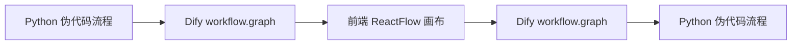
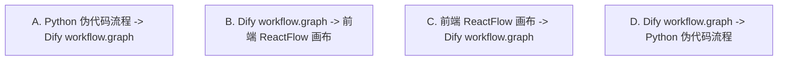
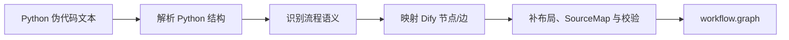
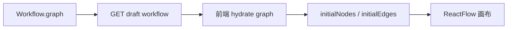
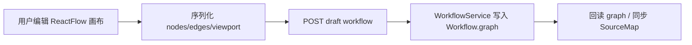
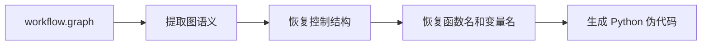

# Python 伪代码流程、Dify workflow.graph 与 ReactFlow 画布双向转换方案

本文面向负责实现“自研 AgentNetwork 的 Python 伪代码流程与 Dify 画布双向同步”的开发团队。

本文只讨论这条链路：

```text
Python 伪代码流程 -> Dify workflow.graph -> 前端 ReactFlow 画布
前端 ReactFlow 画布 -> Dify workflow.graph -> Python 伪代码流程
```

当前阶段不讨论 DSL，也不讨论 Dify GraphEngine 的真实运行。原因是：

- DSL 只是导入/导出文件外壳，不是这条链路的必要环节。
- Dify Studio 画布真正读写的是 `workflow.graph`。
- 我们当前目标是可视化和流程信息传递，不要求每个 Dify 节点都能发布运行。

## 1. 项目理解

### 1.1 三个核心对象

本项目只围绕三个主对象展开：



三个对象的职责：

| 对象 | 职责 | 是否 Dify 原生 |
| --- | --- | --- |
| Python 伪代码流程 | AgentNetwork 给出的流程编排结果，函数名代表任务/节点，`if/else/for` 代表控制流 | 否，自研格式 |
| Dify `workflow.graph` | Dify Studio 画布和后端 draft workflow 共同使用的 graph JSON | 是，Dify 核心结构 |
| 前端 ReactFlow 画布 | Dify Studio 中用户看到和编辑的画布 | 是，Dify 前端已实现 |

核心判断：

```text
我们不是要把 Python 伪代码变成 DSL。
我们要把 Python 伪代码变成 Dify workflow.graph。
```

### 1.2 四个单向箭头

后续开发按四个箭头拆分：



| 箭头 | 性质 | 主要实现方 | 难度 |
| --- | --- | --- | --- |
| A | 正向编译 | 自研为主，复用 Dify 默认节点配置 | 中到高 |
| B | 画布加载 | Dify 已有，集成验收为主 | 低 |
| C | 画布保存 | Dify 已有，集成验收为主 | 低 |
| D | 反向反编译 | 自研为主，依赖 SourceMap 降低难度 | 高 |

## 2. Dify 已经规定好的数据契约

### 2.1 `workflow.graph` 的后端契约

Dify 后端保存 draft workflow 的请求体定义在：

```text
api/controllers/console/app/workflow.py
SyncDraftWorkflowPayload
```

当前代码位置：

```text
api/controllers/console/app/workflow.py:102
```

结构是：

```python
class SyncDraftWorkflowPayload(BaseModel):
    graph: dict[str, Any]
    features: dict[str, Any]
    hash: str | None = None
    environment_variables: list[dict[str, Any]] = Field(default_factory=list)
    conversation_variables: list[dict[str, Any]] = Field(default_factory=list)
```

所以如果我们不走 DSL，而是直接写 draft workflow，最终要提交的 payload 大致是：

```json
{
  "graph": {
    "nodes": [],
    "edges": [],
    "viewport": {
      "x": 0,
      "y": 0,
      "zoom": 0.7
    }
  },
  "features": {},
  "environment_variables": [],
  "conversation_variables": [],
  "hash": null
}
```

后端写入服务：

```text
api/services/workflow_service.py
WorkflowService.sync_draft_workflow()
```

当前代码位置：

```text
api/services/workflow_service.py:273
```

它做的事情：

1. 读取当前 draft workflow。
2. 用 `hash` 做并发保护。
3. 校验 `features`。
4. 轻量校验 `graph`。
5. 把 `graph` JSON 序列化写入 `Workflow.graph`。
6. 返回新的 workflow hash。

### 2.2 `workflow.graph` 的 Python dict 形态

Dify 自己的 workflow generator 也定义了一套 graph TypedDict，直接说明 graph 应该长什么样：

```text
api/core/workflow/generator/types.py
GraphNodeDict
GraphEdgeDict
GraphDict
```

关键定义位置：

```text
api/core/workflow/generator/types.py:83
api/core/workflow/generator/types.py:88
api/core/workflow/generator/types.py:104
api/core/workflow/generator/types.py:122
```

简化后的结构：

```python
workflow_graph = {
    "nodes": [
        {
            "id": "node_id",
            "type": "custom",
            "position": {"x": 100, "y": 100},
            "data": {
                "type": "llm",
                "title": "节点标题",
                "desc": "",
            },
            "width": 244,
            "height": 90,
            "positionAbsolute": {"x": 100, "y": 100},
            "sourcePosition": "right",
            "targetPosition": "left",
        }
    ],
    "edges": [
        {
            "id": "source-source-target-target",
            "source": "source",
            "target": "target",
            "type": "custom",
            "sourceHandle": "source",
            "targetHandle": "target",
            "data": {
                "sourceType": "start",
                "targetType": "llm",
                "isInIteration": False,
                "isInLoop": False,
            },
        }
    ],
    "viewport": {"x": 0, "y": 0, "zoom": 0.7},
}
```

字段解释：

| 字段 | 来源 | 用途 |
| --- | --- | --- |
| `nodes[*].id` | 我们生成 | Dify 节点唯一标识，变量引用和边都依赖它 |
| `nodes[*].type` | 固定生成 `custom` | ReactFlow 自定义节点渲染器 |
| `nodes[*].position` | 我们布局生成，或用户拖动后由 Dify 前端保存 | 画布位置 |
| `nodes[*].data.type` | 我们根据函数注册表生成 | Dify 业务节点类型，例如 `start`、`llm`、`if-else` |
| `nodes[*].data.title` | Python 函数名、注释或注册表生成 | 画布标题 |
| `nodes[*].data.*` | 节点类型决定 | Dify 节点面板和后续运行需要的配置 |
| `edges[*].source/target` | 流程顺序和控制流生成 | 连线两端节点 |
| `edges[*].sourceHandle` | 普通边或分支 case 生成 | 决定从哪个出口连出 |
| `edges[*].targetHandle` | 通常为 `target` | 决定连到哪个入口 |
| `edges[*].data.sourceType/targetType` | 根据 source/target 节点类型生成 | Dify 前端展示和交互辅助 |

### 2.3 前端 ReactFlow 的类型契约

前端节点类型定义在：

```text
web/app/components/workflow/types.ts
BlockEnum
Node
Edge
WorkflowDataUpdater
```

当前代码位置：

```text
web/app/components/workflow/types.ts:28
web/app/components/workflow/types.ts:78
web/app/components/workflow/types.ts:138
web/app/components/workflow/types.ts:145
web/app/components/workflow/types.ts:147
```

其中 `BlockEnum` 规定了 Dify 前端能识别的节点类型：

```text
start, end, answer, llm, knowledge-retrieval, question-classifier,
if-else, code, template-transform, http-request, tool,
parameter-extractor, iteration, document-extractor, list-operator,
agent, loop, human-input, datasource, trigger-webhook 等
```

`WorkflowDataUpdater` 是前端工作流数据形态：

```ts
export type WorkflowDataUpdater = {
  nodes: Node[]
  edges: Edge[]
  viewport: Viewport
}
```

这和后端 `workflow.graph` 基本一致。

### 2.4 draft workflow 读写接口

后端读取和保存 draft 的控制器：

```text
api/controllers/console/app/workflow.py
DraftWorkflowApi.get()
DraftWorkflowApi.post()
```

当前代码位置：

```text
api/controllers/console/app/workflow.py:430
api/controllers/console/app/workflow.py:446
api/controllers/console/app/workflow.py:492
```

接口：

```text
GET  /apps/{app_id}/workflows/draft
POST /apps/{app_id}/workflows/draft
```

前端 service：

```text
web/service/workflow.ts
fetchWorkflowDraft()
syncWorkflowDraft()
```

当前代码位置：

```text
web/service/workflow.ts:18
web/service/workflow.ts:22
```

## 3. 辅助数据结构：函数注册表与 SourceMap

虽然主流程只有三个对象，但开发时建议保留两个辅助产物。

### 3.1 函数注册表

Python 伪代码里的函数名本身不能告诉我们它应该变成 Dify 哪类节点。例如：

```python
parsed = parse_file(file)
answer = answer_llm(query, parsed)
```

`parse_file` 可能对应 `code`、`tool`、`http-request`，必须有注册表说明。

建议函数注册表形态：

```yaml
functions:
  answer_llm:
    dify_type: llm
    title: 生成回答
    inputs:
      query: string
      context: string
    outputs:
      text: string
    default_config:
      model:
        provider: langgenius/openai/openai
        name: gpt-4o-mini
        mode: chat

  parse_file:
    dify_type: code
    title: 解析文件
    inputs:
      file: file
    outputs:
      result: string
    default_config:
      code_language: python3
```

来源：

- 你们 AgentNetwork 的节点/函数定义。
- 项目配置文件。
- 或管理后台维护的映射表。

用途：

- `Python 函数调用 -> Dify node.data.type`。
- `Python 参数 -> Dify value_selector`。
- `Python 变量名 -> Dify 节点输出变量`。

### 3.2 SourceMap

SourceMap 用来降低 `workflow.graph -> Python 伪代码` 的难度。

建议单独保存，不建议放在 Dify 前端会清理的 `_xxx` 临时字段里。

形态示例：

```json
{
  "version": 1,
  "app_id": "dify-app-id",
  "source_hash": "hash-of-python-pseudocode",
  "nodes": {
    "answer_llm": {
      "python": {
        "function": "answer_llm",
        "assigned_to": "answer",
        "lineno": 8,
        "args": ["query", "parsed"]
      },
      "dify": {
        "node_id": "answer_llm",
        "node_type": "llm",
        "outputs": {
          "answer": "text"
        }
      }
    }
  },
  "edges": {
    "classify_input-has_file-parse_file-target": {
      "python": {
        "control": "if",
        "case": "has_file"
      }
    }
  }
}
```

原因：

- 用户拖动画布只改变位置，不应改变 Python 伪代码语义。
- 用户改连线、删节点、改分支后，SourceMap 能帮助判断哪些 Python 结构还能保留。
- 没有 SourceMap 时，反编译只能根据 Dify node id/title 猜函数名和变量名。

## 4. A 箭头：Python 伪代码流程 -> Dify workflow.graph

总体流程：



### A1 -> A2：解析 Python 结构

| 项 | 内容 |
| --- | --- |
| 输入来源 | AgentNetwork 输出的 Python 伪代码字符串 |
| 输入形态 | `str`，内容是 Python-like 代码 |
| 输出形态 | Python AST/CST 或自定义语句列表 |
| 使用 Dify 代码 | 不使用 |
| 实现方式 | 自研 |

输入示例：

```python
if file:
    parsed = parse_file(file)
    answer = answer_llm(query, parsed)
else:
    answer = text_llm(query)

reply(answer)
```

输出建议形态：

```python
{
    "body": [
        {
            "kind": "if",
            "test": "file",
            "body": [
                {"kind": "assign_call", "target": "parsed", "func": "parse_file", "args": ["file"]},
                {"kind": "assign_call", "target": "answer", "func": "answer_llm", "args": ["query", "parsed"]},
            ],
            "orelse": [
                {"kind": "assign_call", "target": "answer", "func": "text_llm", "args": ["query"]},
            ],
        },
        {"kind": "call", "func": "reply", "args": ["answer"]},
    ]
}
```

实现建议：

- 如果伪代码保证是合法 Python，优先用标准库 `ast`。
- 如果要保留注释、原始格式和行列位置，用 `libcst`。
- 如果伪代码不完全合法 Python，用 `tree-sitter-python` 或先要求 AgentNetwork 输出合法子集。

第一版限制：

```text
支持：赋值、函数调用、if/else、return/reply。
暂缓：任意 class、try/except、with、复杂 while、动态函数调用、任意表达式求值。
```

### A2 -> A3：识别流程语义

| 项 | 内容 |
| --- | --- |
| 输入来源 | A2 生成的 AST/CST 或语句列表 |
| 输入形态 | 结构化 Python 语句 |
| 输出形态 | 编译器内部流程语义对象 |
| 使用 Dify 代码 | 不使用 |
| 实现方式 | 自研 |

原因：

AST 只是语法树，不知道哪些函数应该是节点、哪些变量是节点输出、哪些表达式应该成为 Dify 分支条件。需要把 Python 结构转换成“流程语义”。

输出建议形态：

```python
flow_semantics = {
    "inputs": [
        {"name": "query", "type": "paragraph"},
        {"name": "file", "type": "file"},
    ],
    "steps": [
        {
            "id": "classify_file",
            "kind": "branch",
            "condition": "file",
            "cases": [
                {"case_id": "true", "body": ["parse_file", "answer_llm"]},
                {"case_id": "false", "body": ["text_llm"]},
            ],
        },
        {
            "id": "parse_file",
            "kind": "call",
            "function": "parse_file",
            "assign_to": "parsed",
            "args": ["file"],
        },
        {
            "id": "answer_llm",
            "kind": "call",
            "function": "answer_llm",
            "assign_to": "answer",
            "args": ["query", "parsed"],
        },
        {
            "id": "reply",
            "kind": "terminal",
            "function": "reply",
            "args": ["answer"],
        },
    ],
}
```

这里的流程语义对象是编译器内部结构，不需要暴露给 Dify，也不等同于完整 IR。保留它的原因是方便测试和解耦。

### A3 -> A4：映射 Dify 节点和边

| 项 | 内容 |
| --- | --- |
| 输入来源 | A3 的流程语义对象、函数注册表、Dify 默认节点配置 |
| 输入形态 | `flow_semantics + function_registry + default_block_config` |
| 输出形态 | 初版 `nodes`、`edges` |
| 使用 Dify 代码 | 修改使用 |
| 实现方式 | 自研 builder，复用 Dify 默认节点配置接口 |

Dify 可复用位置：

```text
api/controllers/console/app/workflow.py:1168
DefaultBlockConfigsApi

api/controllers/console/app/workflow.py:1195
DefaultBlockConfigApi

api/services/workflow_service.py:806
WorkflowService.get_default_block_configs()

api/services/workflow_service.py:833
WorkflowService.get_default_block_config()
```

前端调用位置：

```text
web/service/workflow.ts:29
fetchNodesDefaultConfigs()

web/service/workflow.ts:53
fetchNodeDefault()
```

建议做法：

- 生成节点时，不从零手拼所有 `data` 字段。
- 优先获取 Dify 默认节点配置作为模板。
- 在模板上覆盖 `title`、`desc`、`variables`、`prompt_template`、`code`、`outputs` 等字段。

映射规则示例：

| Python 语义 | Dify 节点 |
| --- | --- |
| 用户输入变量 | `start` |
| `x = text_llm(...)` | `llm` |
| `x = parse_file(...)` | `code` 或 `tool`，由函数注册表决定 |
| `if file:` | `if-else` |
| `reply(answer)` | `answer` |
| `return result` | `end` |

节点输出示例：

```python
node = {
    "id": "answer_llm",
    "type": "custom",
    "position": {"x": 520, "y": 120},
    "data": {
        "type": "llm",
        "title": "生成回答",
        "desc": "",
        "model": {...},
        "prompt_template": [
            {"role": "user", "text": "{{#start.query#}}\n{{#parse_file.result#}}"}
        ],
        "variables": [],
    },
}
```

边输出示例：

```python
edge = {
    "id": "parse_file-source-answer_llm-target",
    "type": "custom",
    "source": "parse_file",
    "sourceHandle": "source",
    "target": "answer_llm",
    "targetHandle": "target",
    "data": {
        "sourceType": "code",
        "targetType": "llm",
        "isInIteration": False,
        "isInLoop": False,
    },
}
```

### A4 -> A5：补布局、SourceMap 与校验

| 项 | 内容 |
| --- | --- |
| 输入来源 | A4 的初版 nodes/edges |
| 输入形态 | 不完整或未校验的 graph |
| 输出形态 | 可被 Dify 前端读取的 `workflow.graph`，以及 SourceMap |
| 使用 Dify 代码 | 参考使用，不直接依赖 |
| 实现方式 | 自研校验器和布局器 |

Dify 可参考代码：

```text
api/core/workflow/generator/types.py
GraphDict / GraphNodeDict / GraphEdgeDict

api/core/workflow/generator/runner.py
```

Dify 前端也会补一部分字段：

```text
web/app/components/workflow/utils/workflow-init.ts:196
initialNodes()

web/app/components/workflow/utils/workflow-init.ts:314
initialEdges()
```

但不要完全依赖前端兜底。生成器至少应补齐：

```text
node.type = "custom"
node.position
node.data.type
node.data.title
edge.type = "custom"
edge.sourceHandle
edge.targetHandle
edge.data.sourceType
edge.data.targetType
graph.viewport
```

校验项：

- 节点 id 唯一。
- edge 的 source/target 存在。
- 普通边 handle 默认是 `source -> target`。
- `if-else` 出边 `sourceHandle` 对应 case id 或 `false`。
- 变量引用指向真实上游变量。
- `answer` 或 `end` 引用的变量存在。

### A5 -> A6：输出 workflow.graph

| 项 | 内容 |
| --- | --- |
| 输入来源 | A5 校验后的 graph |
| 输入形态 | `{nodes, edges, viewport}` |
| 输出形态 | Dify `workflow.graph` JSON |
| 使用 Dify 代码 | 最终要符合 `SyncDraftWorkflowPayload.graph` |
| 实现方式 | 自研输出，后续交给 draft 保存接口 |

输出示例：

```python
{
    "nodes": [...],
    "edges": [...],
    "viewport": {"x": 0, "y": 0, "zoom": 0.7},
}
```

如果要立刻展示到 Dify Studio，A 箭头的最终产物需要再提交给：

```text
POST /apps/{app_id}/workflows/draft
```

请求体使用第 2.1 节的 `SyncDraftWorkflowPayload`。

## 5. B 箭头：Dify workflow.graph -> 前端 ReactFlow 画布

这条箭头 Dify 已经实现，主要工作是集成和验收。

总体流程：



### B1 -> B2：读取 draft workflow

| 项 | 内容 |
| --- | --- |
| 输入来源 | 数据库 `workflows.graph` |
| 输入形态 | JSON 字符串，后端通过 `Workflow.graph_dict` 转成 dict |
| 输出形态 | `WorkflowResponse` |
| 使用 Dify 代码 | 直接使用 |
| 实现方式 | 不需要自研 |

后端位置：

```text
api/controllers/console/app/workflow.py:430
DraftWorkflowApi

api/controllers/console/app/workflow.py:446
DraftWorkflowApi.get()

api/models/workflow.py:296
Workflow.graph_dict
```

返回结构由 `WorkflowResponse` 定义：

```text
api/controllers/console/app/workflow.py:221
WorkflowResponse
```

关键字段：

```python
{
    "id": "...",
    "graph": {...},
    "features": {...},
    "hash": "...",
    "environment_variables": [],
    "conversation_variables": [],
}
```

### B2 -> B3：前端获取并 hydrate graph

| 项 | 内容 |
| --- | --- |
| 输入来源 | B2 返回的 `WorkflowResponse.graph` |
| 输入形态 | `{nodes, edges, viewport}` |
| 输出形态 | `WorkflowDataUpdater` |
| 使用 Dify 代码 | 直接使用 |
| 实现方式 | 不需要自研 |

前端位置：

```text
web/service/workflow.ts:18
fetchWorkflowDraft()

web/app/components/workflow-app/hooks/use-workflow-init.ts:67
useWorkflowInit()

web/app/components/workflow-app/hooks/use-workflow-init.ts:100
fetchWorkflowDraft(`/apps/${appDetail.id}/workflows/draft`)

web/app/components/workflow-app/hooks/use-workflow-draft-graph-for-canvas.ts:57
getWorkflowDraftGraphForCanvas()
```

`getWorkflowDraftGraphForCanvas()` 做的事情：

- 取 `graph.nodes`。
- 取 `graph.edges`。
- 取 `graph.viewport`。
- workflow 模式如果没有 start/trigger，会本地加 start-placeholder。

### B3 -> B4：初始化 ReactFlow nodes/edges

| 项 | 内容 |
| --- | --- |
| 输入来源 | hydrate 后的 graph |
| 输入形态 | Dify graph nodes/edges |
| 输出形态 | ReactFlow nodes/edges |
| 使用 Dify 代码 | 直接使用 |
| 实现方式 | 不需要自研 |

前端位置：

```text
web/app/components/workflow/utils/workflow-init.ts:196
initialNodes()

web/app/components/workflow/utils/workflow-init.ts:314
initialEdges()

web/app/components/workflow-app/index.tsx:88
initialNodes(data.graph.nodes, data.graph.edges)

web/app/components/workflow-app/index.tsx:96
initialEdges(data.graph.edges, data.graph.nodes)
```

`initialNodes()` 会补：

- `type: custom`。
- 默认 `position`。
- `_connectedSourceHandleIds`。
- `_connectedTargetHandleIds`。
- `if-else` 的 `_targetBranches`。
- `iteration/loop` 的 `_children`。
- 部分旧模型 provider 名称修正。

`initialEdges()` 会补：

- `type: custom`。
- 默认 `sourceHandle: source`。
- 默认 `targetHandle: target`。
- `data.sourceType`。
- `data.targetType`。
- 过滤部分 cycle edge。

### B4 -> B5：ReactFlow 渲染

| 项 | 内容 |
| --- | --- |
| 输入来源 | B4 的 ReactFlow nodes/edges |
| 输入形态 | `Node[]`、`Edge[]` |
| 输出形态 | Dify Studio 画布 |
| 使用 Dify 代码 | 直接使用 |
| 实现方式 | 不需要自研 |

开发者任务：

- 不需要重写 ReactFlow 画布。
- 需要验证 A 生成的 graph 能被 Dify 前端正常显示。
- 如果显示异常，优先修 A 的 graph 字段，不优先改 Dify 前端。

## 6. C 箭头：前端 ReactFlow 画布 -> Dify workflow.graph

这条箭头 Dify 已经实现，主要工作是集成、回读和 SourceMap 同步。

总体流程：



### C1 -> C2：序列化画布

| 项 | 内容 |
| --- | --- |
| 输入来源 | ReactFlow store 当前状态 |
| 输入形态 | 前端当前 `nodes`、`edges`、`transform` |
| 输出形态 | draft sync 参数中的 `graph` |
| 使用 Dify 代码 | 直接使用 |
| 实现方式 | 不需要自研，但要理解清理规则 |

前端位置：

```text
web/app/components/workflow-app/hooks/use-nodes-sync-draft.ts:19
useNodesSyncDraftBase()

web/app/components/workflow-app/hooks/use-nodes-sync-draft.ts:29
getPostParams()
```

`getPostParams()` 做的事情：

- 从 ReactFlow store 取 `getNodes()`、`edges`、`transform`。
- 过滤临时节点：`_isTempNode`。
- 过滤 start-placeholder。
- 删除 `node.data` 中 `_` 开头的字段。
- 删除 `edge.data` 中 `_` 开头的字段。
- 组装 `graph.nodes`、`graph.edges`、`graph.viewport`。
- 组装 `features`、环境变量、会话变量、hash。

输出形态：

```ts
{
  url: `/apps/${appId}/workflows/draft`,
  params: {
    graph: {
      nodes: producedNodes,
      edges: producedEdges,
      viewport: { x, y, zoom },
    },
    features: featuresPayload,
    environment_variables: environmentVariables,
    conversation_variables: conversationVariables,
    hash: syncWorkflowDraftHash,
  },
}
```

重要提醒：

```text
Dify 前端保存时会删除 data 里所有 "_" 开头字段。
SourceMap 不要只保存在 _agentnetwork_xxx 这类字段中。
```

### C2 -> C3：POST draft workflow

| 项 | 内容 |
| --- | --- |
| 输入来源 | C2 的 sync 参数 |
| 输入形态 | `SyncDraftWorkflowPayload` |
| 输出形态 | HTTP 请求 |
| 使用 Dify 代码 | 直接使用 |
| 实现方式 | 不需要自研 |

前端位置：

```text
web/service/workflow.ts:22
syncWorkflowDraft()

web/app/components/workflow-app/hooks/use-nodes-sync-draft.ts:157
syncWorkflowDraft(postParams)
```

接口：

```text
POST /apps/{app_id}/workflows/draft
```

### C3 -> C4：后端写入 Workflow.graph

| 项 | 内容 |
| --- | --- |
| 输入来源 | C3 的 POST 请求体 |
| 输入形态 | `SyncDraftWorkflowPayload` |
| 输出形态 | 数据库 `Workflow.graph` 更新，返回新 hash |
| 使用 Dify 代码 | 直接使用 |
| 实现方式 | 不需要自研 |

后端位置：

```text
api/controllers/console/app/workflow.py:492
DraftWorkflowApi.post()

api/services/workflow_service.py:273
WorkflowService.sync_draft_workflow()
```

返回形态：

```python
{
    "result": "success",
    "hash": workflow.unique_hash,
    "updated_at": "...",
}
```

### C4 -> C5：回读 graph 与同步 SourceMap

| 项 | 内容 |
| --- | --- |
| 输入来源 | 保存成功后的 Dify draft graph |
| 输入形态 | 最新 `workflow.graph` |
| 输出形态 | 可供 D 箭头反编译使用的 graph + SourceMap 状态 |
| 使用 Dify 代码 | 读取 graph 直接使用，SourceMap 自研 |
| 实现方式 | 需要自研 |

原因：

用户可能在画布做这些操作：

- 拖动节点位置。
- 修改节点标题。
- 新增节点。
- 删除节点。
- 改变连线。
- 改变分支出口。

其中：

- 只拖动位置，不应改变 Python 伪代码。
- 改标题，可能只影响显示名。
- 改节点和连线，会改变流程语义。

建议实现：

- 每次需要反编译前，调用 `GET /apps/{id}/workflows/draft` 回读最新 graph。
- 用 node id / edge id 对比 SourceMap。
- 对新增节点生成 fallback 函数名。
- 对删除节点清理对应 SourceMap。
- 对改线操作标记为“结构已变更”，交给 D 箭头重新恢复控制结构。

## 7. D 箭头：Dify workflow.graph -> Python 伪代码流程

这是最难的部分。Dify 没有现成函数能把 graph 反编译为 Python 伪代码。

总体流程：



### D1 -> D2：提取图语义

| 项 | 内容 |
| --- | --- |
| 输入来源 | C5 回读的 `workflow.graph` |
| 输入形态 | `{nodes, edges, viewport}` |
| 输出形态 | 节点表、边表、变量依赖表 |
| 使用 Dify 代码 | 参考类型定义，不直接复用 |
| 实现方式 | 自研 |

输入示例：

```python
{
    "nodes": [
        {"id": "start", "data": {"type": "start", "variables": [...] }},
        {"id": "branch_1", "data": {"type": "if-else", "cases": [...] }},
        {"id": "answer_llm", "data": {"type": "llm", "prompt_template": [...] }},
        {"id": "answer", "data": {"type": "answer", "answer": "{{#answer_llm.text#}}"}},
    ],
    "edges": [...],
}
```

输出建议形态：

```python
graph_semantics = {
    "nodes": {
        "answer_llm": {
            "type": "llm",
            "title": "生成回答",
            "outputs": ["text"],
            "variable_refs": [["start", "query"], ["parse_file", "result"]],
        }
    },
    "edges": [
        {
            "source": "branch_1",
            "sourceHandle": "true",
            "target": "parse_file",
        }
    ],
    "entry": "start",
    "terminals": ["answer"],
}
```

需要解析的变量引用：

```text
字符串模板：{{#node_id.variable#}}
selector： [node_id, variable]
```

### D2 -> D3：恢复控制结构

| 项 | 内容 |
| --- | --- |
| 输入来源 | D2 的图语义 |
| 输入形态 | 节点表、边表、分支 handle |
| 输出形态 | 顺序块、分支块、终止块 |
| 使用 Dify 代码 | 不使用 |
| 实现方式 | 自研图算法 |

实现建议：

- 从 `start` 节点开始拓扑遍历。
- 普通节点按唯一出边串成顺序块。
- `if-else` 节点按 `cases[*].case_id` 和 `false` handle 生成分支块。
- 遇到 `answer` 或 `end` 生成终止块。
- 对无法结构化的图，输出保守形式，例如按拓扑序生成函数调用并附加注释。

输出建议形态：

```python
control_tree = {
    "kind": "block",
    "body": [
        {
            "kind": "if",
            "condition_node": "branch_1",
            "cases": [
                {
                    "case_id": "true",
                    "body": [
                        {"kind": "call", "node_id": "parse_file"},
                        {"kind": "call", "node_id": "answer_llm"},
                    ],
                },
                {
                    "case_id": "false",
                    "body": [
                        {"kind": "call", "node_id": "text_llm"},
                    ],
                },
            ],
        },
        {"kind": "terminal", "node_id": "answer"},
    ],
}
```

第一版限制：

```text
只保证反编译我们自己生成、用户轻度修改后的 graph。
不承诺任意 Dify graph 都能还原为优雅 Python 伪代码。
```

### D3 -> D4：恢复函数名和变量名

| 项 | 内容 |
| --- | --- |
| 输入来源 | D3 的控制结构、SourceMap、函数注册表、graph node data |
| 输入形态 | `control_tree + source_map + function_registry` |
| 输出形态 | 带函数名、变量名的伪代码语义 |
| 使用 Dify 代码 | 不使用 |
| 实现方式 | 自研 |

恢复优先级：

1. SourceMap 中的原始函数名和变量名。
2. 函数注册表中的默认函数名。
3. `node.id` 清洗后作为函数名。
4. `node.data.title` 清洗后作为函数名。
5. fallback：`run_<node_type>_<index>()`。

输出建议形态：

```python
pseudocode_model = {
    "body": [
        {
            "kind": "assign_call",
            "target": "parsed",
            "func": "parse_file",
            "args": ["file"],
        },
        {
            "kind": "assign_call",
            "target": "answer",
            "func": "answer_llm",
            "args": ["query", "parsed"],
        },
        {
            "kind": "call",
            "func": "reply",
            "args": ["answer"],
        },
    ]
}
```

### D4 -> D5：生成 Python 伪代码文本

| 项 | 内容 |
| --- | --- |
| 输入来源 | D4 的伪代码语义模型 |
| 输入形态 | 结构化 block/call/if/return |
| 输出形态 | Python-like 文本 |
| 使用 Dify 代码 | 不使用 |
| 实现方式 | 自研 |

输出示例：

```python
if has_file(file):
    parsed = parse_file(file)
    answer = answer_llm(query, parsed)
else:
    answer = text_llm(query)

reply(answer)
```

实现方式：

- 第一版可用模板字符串生成，不必构造真正 Python AST。
- 后续如果要保证 Python 语法合法，可构造 `ast.Module` 再用 `ast.unparse()`。

## 8. 任务包划分

下面按箭头和子步骤划分任务。一个人可以认领一个或多个任务包。

| 任务包 | 覆盖子步骤 | 输入 | 输出 | Dify 复用策略 | 难度 |
| --- | --- | --- | --- | --- | --- |
| T1 Python 解析 | A1 -> A3 | Python 伪代码文本 | 流程语义对象 | 不使用 Dify，自研 | 中 |
| T2 Dify graph 生成 | A3 -> A6 | 流程语义对象、函数注册表 | `workflow.graph`、SourceMap | 修改使用默认节点配置接口 | 中高 |
| T3 画布加载集成 | B 全部 | `workflow.graph` | ReactFlow 画布显示 | 直接使用 Dify | 低 |
| T4 画布保存集成 | C1 -> C4 | ReactFlow 画布 | 更新后的 `Workflow.graph` | 直接使用 Dify | 低 |
| T5 SourceMap 同步 | C4 -> C5 | 保存后的 graph、旧 SourceMap | 新 SourceMap 状态 | 自研 | 中 |
| T6 graph 反编译 | D 全部 | `workflow.graph`、SourceMap | Python 伪代码文本 | 自研 | 高 |

推荐优先级：

1. T2 手写最小 graph 生成器，不接 Python 解析，先证明 Dify 能显示。
2. T3/T4 验证 Dify 前端读写链路。
3. T1 接入 Python 伪代码正向生成 graph。
4. T5 保存 SourceMap。
5. T6 做受限 graph 反编译。

## 9. 第一版建议支持范围

### 9.1 Python 伪代码支持范围

支持：

```text
变量赋值
函数调用
if / else
return
reply(...)
```

暂缓：

```text
任意 for / while
嵌套复杂循环
try / except
class / decorator
动态函数调用
复杂表达式求值
跨函数调用图
```

### 9.2 Dify 节点支持范围

第一版建议支持：

```text
start
if-else
llm
code
template-transform
http-request
answer
end
```

第二版再考虑：

```text
knowledge-retrieval
tool
agent
iteration
loop
human-input
```

原因：

- `llm/code/http-request/template-transform` 足够表达大量伪代码函数调用。
- `if-else` 足够表达基础条件流。
- `answer/end` 足够表达终点。
- `iteration/loop/agent/tool` 的 Dify 配置更复杂，不适合第一版同时攻克。

## 10. 关键源码索引

| 目标 | 文件和位置 |
| --- | --- |
| draft 保存 payload | `api/controllers/console/app/workflow.py:102` `SyncDraftWorkflowPayload` |
| draft 读取/保存 API | `api/controllers/console/app/workflow.py:430` `DraftWorkflowApi` |
| draft GET | `api/controllers/console/app/workflow.py:446` `DraftWorkflowApi.get()` |
| draft POST | `api/controllers/console/app/workflow.py:492` `DraftWorkflowApi.post()` |
| workflow 写入服务 | `api/services/workflow_service.py:273` `WorkflowService.sync_draft_workflow()` |
| graph 轻量校验 | `api/services/workflow_service.py:1533` `validate_graph_structure()` |
| features 校验 | `api/services/workflow_service.py:1565` `validate_features_structure()` |
| 默认节点配置列表 | `api/controllers/console/app/workflow.py:1168` `DefaultBlockConfigsApi` |
| 单节点默认配置 | `api/controllers/console/app/workflow.py:1195` `DefaultBlockConfigApi` |
| 默认配置服务 | `api/services/workflow_service.py:806` `get_default_block_configs()` |
| 单节点默认配置服务 | `api/services/workflow_service.py:833` `get_default_block_config()` |
| Workflow 模型 | `api/models/workflow.py:168` `Workflow` |
| graph dict | `api/models/workflow.py:296` `Workflow.graph_dict` |
| workflow 导出 dict | `api/models/workflow.py:662` `Workflow.to_dict()` |
| graph TypedDict 参考 | `api/core/workflow/generator/types.py:83` 起 |
| 前端 BlockEnum | `web/app/components/workflow/types.ts:28` |
| 前端 Node/Edge 类型 | `web/app/components/workflow/types.ts:138`、`:145` |
| 前端 WorkflowDataUpdater | `web/app/components/workflow/types.ts:147` |
| 前端读取 draft | `web/service/workflow.ts:18` `fetchWorkflowDraft()` |
| 前端保存 draft | `web/service/workflow.ts:22` `syncWorkflowDraft()` |
| 前端 workflow 初始化 | `web/app/components/workflow-app/hooks/use-workflow-init.ts:67` |
| graph 转画布数据 | `web/app/components/workflow-app/hooks/use-workflow-draft-graph-for-canvas.ts:57` |
| initialNodes | `web/app/components/workflow/utils/workflow-init.ts:196` |
| initialEdges | `web/app/components/workflow/utils/workflow-init.ts:314` |
| 画布保存 hook | `web/app/components/workflow-app/hooks/use-nodes-sync-draft.ts:19` |
| 保存参数构造 | `web/app/components/workflow-app/hooks/use-nodes-sync-draft.ts:29` |

## 11. 验收标准

### 11.1 正向链路验收

输入：

```python
if file:
    parsed = parse_file(file)
    answer = answer_llm(query, parsed)
else:
    answer = text_llm(query)

reply(answer)
```

应满足：

- 能生成 `{nodes, edges, viewport}`。
- graph 可通过 `POST /apps/{id}/workflows/draft` 保存。
- Dify Studio 打开后能显示 start、if-else、code、llm、answer。
- 分支连线正确。
- 节点标题来自函数名或注册表。
- 用户拖动画布后能保存。

### 11.2 反向链路验收

输入：

```text
用户在 Dify Studio 中轻度修改后的 workflow.graph
```

应满足：

- 能回读最新 graph。
- 能识别节点顺序和 `if/else` 分支。
- 能根据 SourceMap 恢复函数名和变量名。
- 能生成可读 Python 伪代码。
- 对无法结构化的 graph 给出明确错误或降级输出，而不是静默生成错误代码。

## 12. 重要工程原则

1. 不引入 DSL 作为主链路。
2. 不修改 Dify 前端画布核心逻辑，优先生成符合 Dify 预期的 graph。
3. SourceMap 单独保存，不依赖 `_` 开头的 Dify 前端临时字段。
4. 第一版只支持受限 Python 子集和少量 Dify 节点。
5. 反编译只承诺支持“我们生成并被用户轻度修改”的 graph。
6. 每个箭头都要有输入输出测试样例，避免后续多人分工时接口含糊。